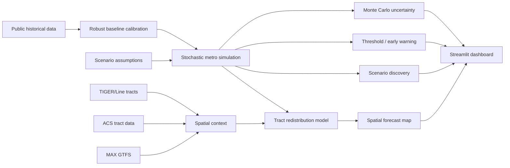

# BHM Urban Futures

**Computational urban analysis for Birmingham–Hoover, Alabama**  
*Simulation • spatial forecasting • uncertainty • scenario discovery • transit accessibility*

## Portfolio thesis

> **What combinations of demographic, employment, housing, infrastructure, public-service, and fiscal conditions could materially change the Birmingham–Hoover metropolitan system — where might those changes appear, when could thresholds be crossed, and how uncertain are those conclusions?**

This is not a one-number population forecast. It is a **scenario laboratory** built around the idea that a metropolitan area behaves as an interconnected system.

## Why this project exists

A 160-question forced-choice career-interest assessment repeatedly pointed toward a specific form of work: **urban data science / computational urban analysis**, especially spatial forecasting, metropolitan change, integrated systems, uncertainty, validation, vulnerability analysis, population dynamics, and applied technical decision support.

`BHM Urban Futures` turns that profile into a tangible portfolio project.

## Architecture



## What is working immediately

The repository includes small bundled historical datasets, so these features run without downloading anything else:

- annual integrated Birmingham–Hoover system simulation;
- population, employment, unemployment, housing pressure, service capacity, infrastructure capacity, fiscal capacity, and system-stress trajectories;
- seven-county population allocation;
- Monte Carlo uncertainty;
- threshold / warning-year detection;
- machine-learning scenario discovery;
- interactive Streamlit scenario controls.

## Flagship spatial layer

Run one command to prepare the larger real-world spatial layers:

```bash
python scripts/prepare_flagship_data.py
```

The pipeline retrieves:

- **real 2024 Census TIGER/Line tract boundaries** for Alabama, then filters to the seven Birmingham–Hoover counties;
- **ACS tract context** for population, income, housing, vacancy, tenure, rent, home value, and transit commuting;
- **MAX Transit GTFS**, validated before use;
- **FHFA HPI and building-permit series** through FRED.

When those files exist, the dashboard unlocks the tract-level spatial-change map and transit-service context. Large refreshed source files are intentionally excluded from Git so the repository stays reproducible instead of becoming a data dump.

## Run locally

```bash
python -m venv .venv
# Windows
.venv\Scripts\activate
# macOS/Linux
source .venv/bin/activate

pip install -r requirements.txt
streamlit run app.py
```

Optional real-world spatial preparation:

```bash
python scripts/prepare_flagship_data.py
streamlit run app.py
```

Tests:

```bash
pytest -q
```

## Dashboard

The Streamlit app contains five analytical views:

1. **System forecast** — coupled metro population, employment, housing, service, infrastructure, fiscal, and stress dynamics.
2. **Spatial change** — seven-county fallback immediately; tract-level real geography after data preparation.
3. **Uncertainty** — Monte Carlo forecast bands and threshold-crossing probability.
4. **Vulnerability lab** — scenario discovery across many combinations of uncertain conditions.
5. **Methodology** — clear separation of observed data and stylized assumptions.

## Scenario discovery

Instead of hand-selecting a few narratives, the project samples combinations of:

- migration change;
- employment growth;
- housing-supply growth;
- housing responsiveness;
- public-service capacity growth;
- infrastructure capacity growth;
- volatility.

A random-forest classifier is then used as a **scenario-discovery tool** to identify which uncertain conditions are most associated with crossing the system-stress threshold. The goal is not to automate policy choice; it is to reveal vulnerability conditions.

## Spatial model

The tract module starts from observed ACS population and updates population shares gradually. A transparent *growth-capacity score* combines housing slack, transit service, income, and housing-cost pressure. The score is deliberately editable and documented.

Important: it is a **scenario allocation mechanism**, not a claim that one neighborhood is “better” than another and not an official tract forecast.

## Repository structure

```text
bhm_urban_futures/
├── app.py
├── src/
│   ├── model.py
│   ├── spatial.py
│   ├── spatial_simulation.py
│   ├── accessibility.py
│   └── discovery.py
├── scripts/
│   └── prepare_flagship_data.py
├── data/
│   ├── birmingham_msa_history.csv
│   ├── msa_county_population_2021_2025.csv
│   ├── raw/
│   └── processed/
├── notebooks/
├── tests/
├── .github/workflows/tests.yml
├── MODEL_CARD.md
├── DATA_SOURCES.md
└── PORTFOLIO_BRIEF.md
```

## Skills demonstrated

Python • pandas • NumPy • scikit-learn • GeoPandas • Shapely • GTFS • spatial joins • stochastic simulation • Monte Carlo analysis • sensitivity / vulnerability analysis • machine learning • Streamlit • Plotly • public-data engineering • testing • GitHub Actions • model documentation

## Strong interview framing

> “I wanted to build something beyond a dashboard. I treated Birmingham–Hoover as a coupled urban system, built a stochastic simulation, quantified uncertainty instead of hiding it, added scenario discovery to find vulnerability conditions, and designed a reproducible GIS/ACS/GTFS pipeline so the model can investigate where metropolitan change could redistribute spatially. I also documented which pieces are observed and which are assumptions, because model risk is part of the analysis.”

## Limitations and responsible interpretation

This is a **portfolio-grade exploratory simulation, not an official Birmingham forecast or policy recommendation**. Historical public data are real; several cross-system equations and spatial redistribution weights are stylized. A production version should perform rolling historical backtests, calibrate each subsystem against observed local data, validate spatial predictions, and review threshold definitions with domain experts.

See `MODEL_CARD.md` for the full limitations and validation roadmap.
